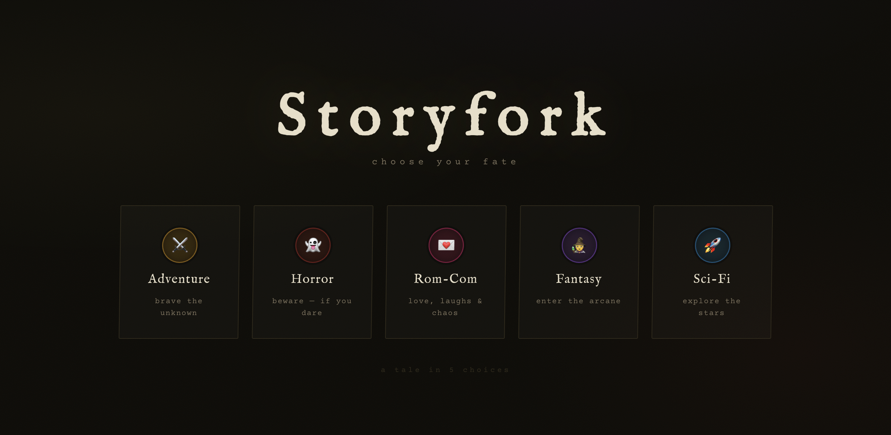

# Storyfork

A browser-based AI-driven text adventure game built with React + Vite. Pick a genre, make choices, and let GPT-4o-mini spin your story to a good or bad ending.



## Features

- **Multiple genres** — each with its own tone, scenarios, fonts, and colour theme
- **Branching story engine** — the LLM generates a unique story every run; no two games are the same
- **Dynamic theming** — CSS variables swap on genre hover/select for an instant visual preview
- **Typewriter animation** — story text animates character-by-character; choices appear only after it finishes
- **Keyboard shortcuts** — press `A` or `B` to choose without touching the mouse
- **Outcome tracking** — a choice timeline on the Game Over screen shows every decision you made
- **Good / bad endings** — the LLM signals the outcome type; the ending screen styles itself accordingly

## Tech Stack

| Layer | Choice |
|---|---|
| Framework | React 18 + Vite 5 |
| AI | OpenAI `gpt-4o-mini` via the `openai` npm package |
| Styling | CSS Modules + CSS custom properties |
| Fonts | Google Fonts (Cinzel, Orbitron, IM Fell English, …) |

## Getting Started

### Prerequisites

- Node.js 18+
- An OpenAI API key

### Setup

```bash
git clone https://github.com/shivanisoman/storyfork.git
cd storyfork
npm install
```

Create a `.env` file in the project root:

```
VITE_OPENAI_API_KEY=sk-...
```

> **Note:** The OpenAI client runs in the browser with `dangerouslyAllowBrowser: true`. This is intentional for a local dev POC — do not deploy this publicly with a real API key.

### Run

```bash
npm run dev       # dev server at http://localhost:5173
npm run build     # production build → dist/
npm run preview   # preview the production build
```

## Project Structure

```
src/
├── App.jsx                   # Game state machine (genre_select → playing → game_over)
├── config/gameConfig.js      # Single source of truth: MAX_TURNS, MODEL, genres, themes
├── services/openai.js        # LLM orchestration + response parsing
├── hooks/useTypewriter.js    # Typewriter animation hook
├── utils/theme.js            # Imperative CSS variable theming
└── components/
    ├── GenreSelector/        # Genre picker with hover-preview theming
    ├── GameScreen/           # Active game: story + choices
    │   ├── StoryDisplay/     # Typewriter-animated story text
    │   └── ChoiceButtons/    # A/B choices with keyboard support
    └── GameOver/             # Ending screen with choice timeline
```

## Configuration

All tuneable values live in `src/config/gameConfig.js`:

| Constant | Default | Description |
|---|---|---|
| `MAX_TURNS` | `5` | Number of story beats before the ending |
| `MODEL` | `gpt-4o-mini` | OpenAI model string |
| `TYPEWRITER_SPEED_MS` | `18` | Ms per character in the typewriter animation |
| `GENRES` | 5 genres | Add/edit genres here; tones, scenarios, and themes are in separate exports |
| `SCENARIO_MODIFIERS` | 12 items | Random complications mixed into the opening prompt |

## How It Works

1. The player selects a genre; a random scenario + modifier are drawn and sent to the LLM as a system prompt.
2. Each turn the full conversation history is sent to OpenAI. The LLM responds using custom delimiters (`[STORY]`, `[CHOICE_A]`, `[CHOICE_B]`) that the app parses with regex.
3. On the penultimate turn the user message is prefixed with `PENULTIMATE TURN` to signal the LLM to set up a climax. On the final turn it's prefixed with `FINAL TURN` — the LLM writes an ending, omits choice tags, and appends `[END]` + `[OUTCOME]good|bad[/OUTCOME]`.
4. The Game Over screen renders the full choice timeline and styles itself based on the outcome.
